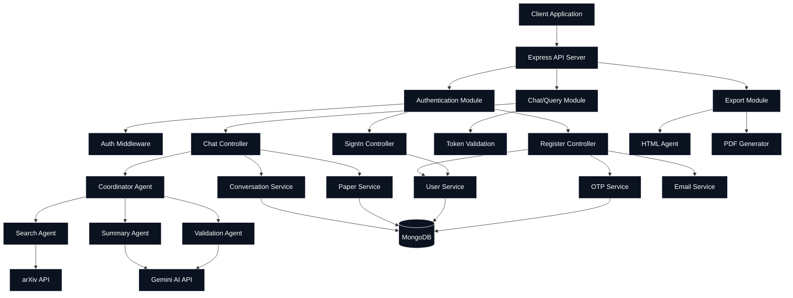
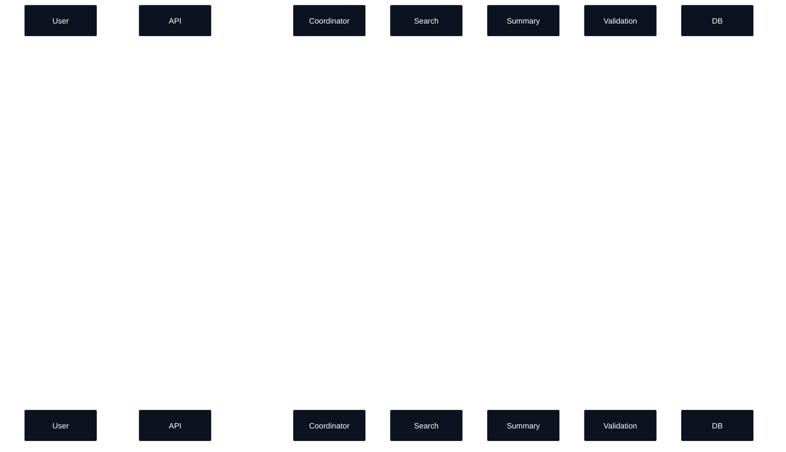
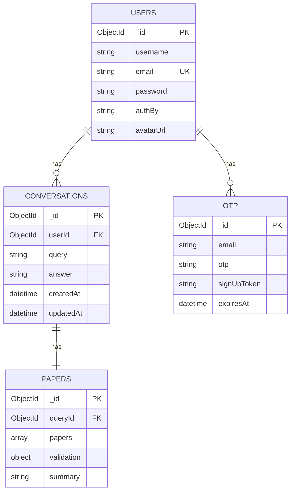

# 🎓 Research Paper Copilot - Backend API

[](https://nodejs.org/)
[](https://expressjs.com/)
[](https://www.mongodb.com/)
[](LICENSE)

> A powerful AI-driven backend system that helps researchers discover, analyze, and summarize academic papers using a multi-agent architecture powered by Google's Gemini AI and arXiv API.

### Demo URL - https://minor-deploy-64gx.vercel.app
### Demo Credentials - kunalx1@gmail.com, Pass- Kunal@1234 

## 📋 Table of Contents

- [Overview](#-overview)
- [Features](#-features)
- [Architecture](#-architecture)
- [Tech Stack](#-tech-stack)
- [Getting Started](#-getting-started)
- [API Documentation](#-api-documentation)
- [Database Schema](#-database-schema)
- [Multi-Agent Pipeline](#-multi-agent-pipeline)
- [Environment Variables](#-environment-variables)
- [Project Structure](#-project-structure)
- [Usage Examples](#-usage-examples)
- [Error Handling](#-error-handling)
- [Contributing](#-contributing)

---

## 🌟 Overview

Research Paper Copilot is an intelligent backend system designed to streamline the research process. It leverages a sophisticated multi-agent architecture to search, summarize, validate, and export research papers based on user queries. The system integrates with arXiv for paper discovery and uses Google's Gemini AI for advanced natural language processing.

### Key Capabilities

- **Intelligent Paper Search**: Automatically searches arXiv database for relevant research papers
- **AI-Powered Summarization**: Generates concise summaries highlighting key contributions and findings
- **Validation & Quality Assurance**: Validates results for accuracy and relevance
- **PDF Export**: Generates professional PDF reports of research findings
- **User Authentication**: Secure email-based authentication with OTP verification
- **Conversation History**: Maintains chat history for all user queries

---

## ✨ Features

### 🔐 Authentication & Authorization
- Email-based registration with OTP verification
- Secure password hashing using bcrypt
- JWT-based session management
- Token validation middleware

### 🤖 Multi-Agent Research Pipeline
- **Search Agent**: Queries arXiv API for relevant papers
- **Summary Agent**: AI-powered summarization using Gemini 2.0 Flash
- **Validation Agent**: Ensures quality and relevance of results
- **HTML Agent**: Formats results for PDF generation

### 📊 Research Management
- Query processing and answer generation
- Paper metadata storage and retrieval
- Conversation history tracking
- PDF export with professional formatting

### 🛡️ Security & Validation
- Input validation using Zod schemas
- Error handling middleware
- CORS configuration
- Cookie-based authentication

---

## 🏗️ Architecture

### System Architecture Diagram



### Multi-Agent Pipeline Flow



### Authentication Flow

```mermaid
%%{init: {"theme":"base","themeVariables":{"actorBorder":"#ffffff","actorBkg":"#0b1220","actorTextColor":"#ffffff","actorLineColor":"#ffffff","signalColor":"#ffffff","signalTextColor":"#ffffff","labelBoxBkgColor":"#0b1220","labelBoxBorderColor":"#ffffff","labelTextColor":"#ffffff","loopTextColor":"#ffffff","noteBorderColor":"#ffffff","noteBkgColor":"#0b1220","noteTextColor":"#ffffff","activationBorderColor":"#ffffff","activationBkgColor":"#0b1220","sequenceNumberColor":"#ffffff"}}}%%
sequenceDiagram
    participant User
    participant API
    participant Middleware
    participant Controller
    participant Service
    participant Email
    participant DB
    
    rect rgb(15, 23, 42)
        Note over User,DB: Registration Flow
        User->>API: POST /auth/email-register
        API->>Middleware: Validate input (Zod)
        Middleware->>Controller: signup()
        Controller->>Controller: Generate OTP & Token
        Controller->>Service: storeInOTPModel()
        Service->>DB: Save OTP temporarily
        Controller->>Email: Send OTP email
        Controller-->>User: {redirectUrl, message}
        
        User->>API: POST /auth/email-register/otp-verification
        API->>Middleware: Check OTP
        Middleware->>Service: Verify OTP
        Service->>DB: Validate OTP
        Middleware->>Controller: register()
        Controller->>Service: storeUserByEmail()
        Service->>DB: Create user
        Controller-->>User: Success message
    end
    
    rect rgb(17, 24, 39)
        Note over User,DB: Sign In Flow
        User->>API: POST /auth/signin
        API->>Middleware: Validate credentials
        Middleware->>Controller: signin()
        Controller->>Service: isUserExists()
        Service->>DB: Find & verify user
        Service-->>Controller: userId
        Controller->>Controller: Generate JWT
        Controller-->>User: Set cookie & success
    end
```



### Export Flow

```mermaid
graph LR
    A[User Request] --> B[GET /export/:queryId]
    B --> C{Token Valid?}
    C -->|No| D[401 Unauthorized]
    C -->|Yes| E{Conversation Exists?}
    E -->|No| F[404 Not Found]
    E -->|Yes| G[Fetch Conversation + Papers]
    G --> H[HTML Agent]
    H --> I[Generate HTML Template]
    I --> J[PDF Generator]
    J --> K[Puppeteer Rendering]
    K --> L[PDF Buffer]
    L --> M[Send PDF to Client]
    
    style A fill:#0b1220,stroke:#ffffff,stroke-width:1px,color:#ffffff
    style B fill:#0b1220,stroke:#ffffff,stroke-width:1px,color:#ffffff
    style C fill:#0b1220,stroke:#ffffff,stroke-width:1px,color:#ffffff
    style D fill:#0b1220,stroke:#ffffff,stroke-width:1px,color:#ffffff
    style E fill:#0b1220,stroke:#ffffff,stroke-width:1px,color:#ffffff
    style F fill:#0b1220,stroke:#ffffff,stroke-width:1px,color:#ffffff
    style G fill:#0b1220,stroke:#ffffff,stroke-width:1px,color:#ffffff
    style H fill:#0b1220,stroke:#ffffff,stroke-width:1px,color:#ffffff
    style I fill:#0b1220,stroke:#ffffff,stroke-width:1px,color:#ffffff
    style J fill:#0b1220,stroke:#ffffff,stroke-width:1px,color:#ffffff
    style K fill:#0b1220,stroke:#ffffff,stroke-width:1px,color:#ffffff
    style L fill:#0b1220,stroke:#ffffff,stroke-width:1px,color:#ffffff
    style M fill:#0b1220,stroke:#ffffff,stroke-width:1px,color:#ffffff
```



---

## 🛠️ Tech Stack

### Backend Framework
- **Node.js** (v18+) - Runtime environment
- **Express.js** (v5.1) - Web application framework

### Database
- **MongoDB** (v8+) - NoSQL database
- **Mongoose** (v8.18) - ODM for MongoDB

### AI & External APIs
- **Google Gemini AI** - Advanced language model for summarization and validation
- **arXiv API** - Research paper database

### Authentication & Security
- **bcrypt** (v6.0) - Password hashing
- **jsonwebtoken** (v9.0) - JWT token generation
- **cookie-parser** - Cookie parsing middleware
- **cors** - Cross-origin resource sharing

### Validation & Error Handling
- **Zod** (v3.25) - Schema validation
- Custom error handling middleware

### Utilities
- **Puppeteer** (v24.19) - PDF generation
- **Nodemailer** (v7.0) - Email service
- **xml2js** (v0.6) - XML parsing for arXiv responses
- **Morgan** - HTTP request logger
- **Nodemon** - Development auto-reload

---

## 🚀 Getting Started

### Prerequisites

Ensure you have the following installed:
- Node.js (v18 or higher)
- MongoDB (v8 or higher) running locally or remote instance
- npm or yarn package manager

### Installation

1. **Clone the repository**
```bash
git clone https://github.com/Kunal-Rathore/Backend_For_ResearchPaper_Copilot.git
cd Backend_For_ResearchPaper_Copilot
```

2. **Install dependencies**
```bash
npm install
```

3. **Configure environment variables**
```bash
cp env.example .env
```

Edit `.env` file with your configuration:
```env
PORT=3000
MONGOO_DB_URL=mongodb://localhost:27017/research-copilot
JWT_SECRET=your_super_secret_jwt_key_here
GEMINI_API=your_google_gemini_api_key
EMAIL_ID=your_email@gmail.com
EMAIL_PASS=your_email_app_password
BACKEND_BASE_Url=http://localhost:3000/app/api
```

4. **Start MongoDB**
```bash
# If using local MongoDB
mongod
```

5. **Run the application**

Development mode (with auto-reload):
```bash
npm run dev
```

Production mode:
```bash
node src/index.js
```

The server will start on `http://localhost:3000`

---

## 📚 API Documentation

### Base URL
```
http://localhost:3000/app/api
```

### Authentication Endpoints

#### 1. Register - Send OTP
**Endpoint:** `POST /auth/email-register`

**Description:** Initiates registration by sending OTP to email

**Request Body:**
```json
{
  "username": "John Doe",
  "email": "john.doe@example.com",
  "password": "SecurePassword123!"
}
```

**Response:**
```json
{
  "message": "OTP sent",
  "redirectUrl": "http://localhost:3000/app/api/auth/email-register/otp-verification?token=xyz123"
}
```

**Status Codes:**
- `200` - OTP sent successfully
- `400` - Invalid input or email already exists
- `500` - Server error

---

#### 2. Check Email Availability
**Endpoint:** `POST /auth/email-register/check-email`

**Description:** Check if email is already registered (for frontend validation)

**Request Body:**
```json
{
  "email": "john.doe@example.com"
}
```

**Response:**
```json
"email not exists"
```
or
```json
"email already exists"
```

**Status Codes:**
- `200` - Email available
- `400` - Email already registered

---

#### 3. Verify OTP & Complete Registration
**Endpoint:** `POST /auth/email-register/otp-verification?token={signUpToken}`

**Description:** Verifies OTP and completes user registration

**Query Parameters:**
- `token` - The signup token received in step 1

**Request Body:**
```json
{
  "otp": "123456"
}
```

**Response:**
```json
{
  "message": "Sign-up Successfull"
}
```

**Status Codes:**
- `200` - Registration successful
- `400` - Invalid OTP or token
- `500` - Server error

---

#### 4. Sign In
**Endpoint:** `POST /auth/signin`

**Description:** Authenticates user and returns JWT token in cookie

**Request Body:**
```json
{
  "email": "john.doe@example.com",
  "password": "SecurePassword123!"
}
```

**Response:**
```json
{
  "message": "Sign-in successfull"
}
```

**Headers Set:**
- `Set-Cookie: token=<jwt_token>`

**Status Codes:**
- `200` - Login successful
- `401` - Invalid credentials
- `500` - Server error

---

#### 5. Check Token Validity
**Endpoint:** `POST /auth/signin/check-token`

**Description:** Validates JWT token

**Headers Required:**
```
Cookie: token=<jwt_token>
```

**Response:**
```json
{
  "message": "Token exists",
  "userId": "507f1f77bcf86cd799439011"
}
```

**Status Codes:**
- `200` - Token valid
- `401` - Token invalid or expired

---

### Chat/Query Endpoints

#### 6. Submit Research Query
**Endpoint:** `POST /chat/query`

**Description:** Processes research query through multi-agent pipeline

*Additional small request/headers examples moved to [APPENDIX.md](APPENDIX.md).*

**Response:**
```json
{
  "message": "Quantum computing has seen significant advancements...",
  "urlToExport": "http://localhost:3000/app/api/export/507f1f77bcf86cd799439011"
}
```

**Status Codes:**
- `200` - Query processed successfully
- `401` - Unauthorized (invalid token)
- `400` - Invalid query format
- `500` - Server or AI service error

---

#### 7. Fetch All Conversations
**Endpoint:** `GET /chat/fetch-all-chat`

**Description:** Retrieves all conversation history for authenticated user

**Headers Required:**
```
Cookie: token=<jwt_token>
```

**Response:**
```json
{
  "result": [
    {
      "_id": "507f1f77bcf86cd799439011",
      "userId": "507f191e810c19729de860ea",
      "query": "What are the latest developments in quantum computing?",
      "answer": "Quantum computing has seen significant advancements...",
      "createdAt": "2024-01-15T10:30:00.000Z",
      "updatedAt": "2024-01-15T10:30:00.000Z"
    }
  ]
}
```

**Status Codes:**
- `200` - Conversations retrieved
- `401` - Unauthorized
- `404` - No previous queries found

---

### Export Endpoints

#### 8. Export Conversation to PDF
**Endpoint:** `POST /export/:queryId`

**Description:** Generates and downloads PDF report for a specific query

**Headers Required:**
```
Cookie: token=<jwt_token>
```

**URL Parameters:**
- `queryId` - The conversation/query ID to export

**Response:**
- Content-Type: `application/pdf`
- Content-Disposition: `attachment; filename=conversation.pdf`
- Body: PDF binary data

**Status Codes:**
- `200` - PDF generated successfully
- `401` - Unauthorized
- `404` - Conversation not found
- `500` - PDF generation error

---

### Error Response Format

All endpoints return errors in the following format:

```json
{
  "status": "error",
  "statusCode": 400,
  "message": "Detailed error message",
  "type": "ValidationError"
}
```

---

## 🗄️ Database Schema

### Collections Overview



### Schema Definitions

#### 1. Users Collection
```javascript
{
  _id: ObjectId,
  username: String (required),
  email: String (required, unique),
  password: String (required, hashed),
  authBy: String (enum: ["Google", "email"], required),
  avatarUrl: String (default: null)
}
```

**Indexes:**
- `email` - Unique index for fast lookups

---

#### 2. Conversations Collection
```javascript
{
  _id: ObjectId,
  userId: ObjectId (ref: Users, required),
  query: String (required),
  answer: String (required),
  createdAt: DateTime (auto),
  updatedAt: DateTime (auto)
}
```

**Indexes:**
- `userId` - For user-specific query retrieval

---

#### 3. Papers Collection
```javascript
{
  _id: ObjectId,
  queryId: ObjectId (ref: Conversations, required),
  papers: [
    {
      paperId: String,
      title: String (required),
      authors: [String] (required),
      url: String
    }
  ],
  summary: String (required),
  validation: {
    isValid: Boolean (required),
    score: Number (required, 0-1),
    feedback: String,
    citations: [String] (required)
  }
}
```

**Indexes:**
- `queryId` - For conversation-specific paper retrieval

---

#### 4. OTP Collection (Temporary Storage)
```javascript
{
  _id: ObjectId,
  email: String (required),
  otp: String (required),
  signUpToken: String (required),
  expiresAt: DateTime (TTL index)
}
```

**Indexes:**
- `signUpToken` - For OTP verification
- `expiresAt` - TTL index for automatic cleanup

---

## 🤖 Multi-Agent Pipeline

### Agent Architecture

The system uses a coordinator pattern with three specialized agents:

```mermaid
graph TD
    A[User Query] --> B[Coordinator Agent]
    
    B --> C[Search Agent]
    C --> C1[Query arXiv API]
    C1 --> C2[Parse XML Response]
    C2 --> C3[Extract Metadata]
    C3 --> D[Papers Array]
    
    D --> E[Summary Agent]
    E --> E1[Format Papers Data]
    E1 --> E2[Gemini 2.0 Flash API]
    E2 --> E3[Generate Summaries]
    E3 --> F[Formatted Summary]
    
    F --> G[Validation Agent]
    G --> G1[Validate Structure]
    G1 --> G2[Gemini 2.5 Flash API]
    G2 --> G3[Quality Check]
    G3 --> H[Final JSON Output]
    
    H --> I[Store in Database]
    I --> J[Return to User]
    
    style A fill:#0b1220,stroke:#ffffff,stroke-width:1px,color:#ffffff
    style B fill:#0b1220,stroke:#ffffff,stroke-width:1px,color:#ffffff
    style C fill:#0b1220,stroke:#ffffff,stroke-width:1px,color:#ffffff
    style C1 fill:#0b1220,stroke:#ffffff,stroke-width:1px,color:#ffffff
    style C2 fill:#0b1220,stroke:#ffffff,stroke-width:1px,color:#ffffff
    style C3 fill:#0b1220,stroke:#ffffff,stroke-width:1px,color:#ffffff
    style D fill:#0b1220,stroke:#ffffff,stroke-width:1px,color:#ffffff
    style E fill:#0b1220,stroke:#ffffff,stroke-width:1px,color:#ffffff
    style E1 fill:#0b1220,stroke:#ffffff,stroke-width:1px,color:#ffffff
    style E2 fill:#0b1220,stroke:#ffffff,stroke-width:1px,color:#ffffff
    style E3 fill:#0b1220,stroke:#ffffff,stroke-width:1px,color:#ffffff
    style F fill:#0b1220,stroke:#ffffff,stroke-width:1px,color:#ffffff
    style G fill:#0b1220,stroke:#ffffff,stroke-width:1px,color:#ffffff
    style G1 fill:#0b1220,stroke:#ffffff,stroke-width:1px,color:#ffffff
    style G2 fill:#0b1220,stroke:#ffffff,stroke-width:1px,color:#ffffff
    style G3 fill:#0b1220,stroke:#ffffff,stroke-width:1px,color:#ffffff
    style H fill:#0b1220,stroke:#ffffff,stroke-width:1px,color:#ffffff
    style I fill:#0b1220,stroke:#ffffff,stroke-width:1px,color:#ffffff
    style J fill:#0b1220,stroke:#ffffff,stroke-width:1px,color:#ffffff
```



### 1. Search Agent

**Purpose:** Retrieves relevant research papers from arXiv

**Process:**
1. Constructs arXiv API query URL
2. Fetches up to 7 most relevant papers
3. Parses XML response using xml2js
4. Extracts paper metadata

**Output Structure:**
```javascript
[
  {
    title: "Paper Title",
    summary: "Abstract text...",
    author: ["Author 1", "Author 2"],
    link: "https://arxiv.org/abs/1234.5678",
    published: "2024-01-15",
    categories: ["cs.AI", "cs.LG"]
  }
]
```

**Error Handling:**
- Falls back to alternative search if arXiv fails
- Throws error for complete API failure

---

### 2. Summary Agent

**Purpose:** Generates structured summaries using Gemini AI

**Process:**
1. Formats search results into readable text
2. Constructs detailed prompt for Gemini 2.0 Flash
3. Requests structured analysis
4. Returns formatted summary

**AI Model:** Google Gemini 2.0 Flash

**Prompt Structure:**
```
For each paper:
1. Summarize main contributions (simple language)
2. Highlight key findings
3. Note important limitations
4. Keep abstracts short (2-3 lines max)
5. Normalize categories
6. Present in numbered format
```

**Output:** Structured text with paper analyses

---

### 3. Validation Agent

**Purpose:** Validates and structures the final response

**Process:**
1. Takes summary from previous agent
2. Validates against strict JSON schema
3. Ensures all required fields are populated
4. Calculates confidence score
5. Provides quality feedback

**AI Model:** Google Gemini 2.5 Flash

**Output Structure:**
```javascript
{
  answer: "Comprehensive answer to user query",
  papers: [
    {
      paperId: "unique-id",
      title: "Paper Title",
      authors: ["Author 1", "Author 2"],
      url: "https://arxiv.org/abs/1234.5678"
    }
  ],
  summary: "Overall summary of all papers",
  validation: {
    isValid: true,
    score: 0.95,
    feedback: "All requirements met",
    citations: ["paper-id-1", "paper-id-2"]
  }
}
```

**Quality Metrics:**
- Ensures non-empty required fields
- Validates JSON structure
- Provides confidence scoring (0.0 - 1.0)
- Tracks citation relevance

---

### Coordinator Agent

**Purpose:** Orchestrates the entire pipeline

**Process:**
```javascript
async function runPipeline(query) {
  // Step 1: Search
  const papers = await searchAgent(query);
  
  // Step 2: Summarize
  const summary = await summaryAgent(papers, query);
  
  // Step 3: Validate
  const result = await validationAgent(summary, query);
  
  return JSON.parse(result);
}
```

**Benefits:**
- Sequential processing ensures data consistency
- Error propagation for better debugging
- Modular design allows easy agent replacement
- Clear separation of concerns

---

## 🔧 Environment Variables

Create a `.env` file in the root directory with the following variables:

| Variable | Description | Example | Required |
|----------|-------------|---------|----------|
| `PORT` | Server port number | `3000` | Yes |
| `MONGOO_DB_URL` | MongoDB connection string | `mongodb://localhost:27017/research-copilot` | Yes |
| `JWT_SECRET` | Secret key for JWT signing | `your_super_secret_key_min_32_chars` | Yes |
| `GEMINI_API` | Google Gemini API key | `AIzaSy...` | Yes |
| `EMAIL_ID` | Email address for sending OTPs | `noreply@yourapp.com` | Yes |
| `EMAIL_PASS` | Email app password (not regular password) | `app_specific_password` | Yes |
| `BACKEND_BASE_Url` | Backend base URL for redirects | `http://localhost:3000/app/api` | Yes |

### Getting API Keys

#### Google Gemini API
1. Visit [Google AI Studio](https://makersuite.google.com/app/apikey)
2. Create a new API key
3. Copy and paste into `.env`

#### Email Configuration (Gmail Example)
1. Enable 2-Factor Authentication on your Google account
2. Go to [App Passwords](https://myaccount.google.com/apppasswords)
3. Generate an app password for "Mail"
4. Use this password in `EMAIL_PASS`

---

## 📁 Project Structure

```
Backend_For_ResearchPaper_Copilot/
│
├── src/
│   ├── agents/                    # Multi-agent pipeline
│   │   ├── coordinatorAgent.js   # Orchestrates agent flow
│   │   ├── searchAgent.js        # arXiv paper search
│   │   ├── summaryAgent.js       # AI summarization
│   │   ├── validationAgent.js    # Result validation
│   │   └── htmlAgent.js          # HTML generation for PDF
│   │
│   ├── config/                    # Configuration files
│   │   └── db.js                 # MongoDB connection
│   │
│   ├── controllers/               # Request handlers
│   │   ├── registerController.js # Registration logic
│   │   ├── signIn_Controller.js  # Authentication logic
│   │   ├── chatController.js     # Query processing
│   │   ├── exportController.js   # PDF export
│   │   └── agentController.js    # Agent coordination
│   │
│   ├── middlewares/               # Express middlewares
│   │   ├── authMiddleware.js     # Authentication checks
│   │   ├── chatMiddleware.js     # Chat validation
│   │   ├── exportMiddleware.js   # Export validation
│   │   └── errorMiddleware.js    # Error handling
│   │
│   ├── models/                    # Mongoose schemas
│   │   ├── UserModel.js          # User schema
│   │   ├── ConversationModel.js  # Conversation schema
│   │   ├── PaperModel.js         # Paper schema
│   │   └── otpModel.js           # OTP schema
│   │
│   ├── routes/                    # API routes
│   │   ├── routesIndex.js        # Main router
│   │   ├── authRoutes.js         # Auth route aggregator
│   │   ├── authRoutes/           # Auth sub-routes
│   │   │   ├── registerRoute.js  # Registration endpoints
│   │   │   └── signRoute.js      # Sign-in endpoints
│   │   ├── chatRoutes.js         # Chat endpoints
│   │   └── exportRoutes.js       # Export endpoints
│   │
│   ├── services/                  # Business logic layer
│   │   ├── userService.js        # User operations
│   │   ├── conversationService.js # Conversation operations
│   │   ├── paperService.js       # Paper operations
│   │   └── OTPServices.js        # OTP operations
│   │
│   ├── utils/                     # Utility functions
│   │   ├── catchAsync.js         # Async error wrapper
│   │   ├── validator.js          # Input validation
│   │   ├── jwt.js                # JWT utilities
│   │   ├── otpAndTokenGenerator.js # OTP/token generation
│   │   ├── otpMailer.js          # Email sending
│   │   ├── pdfGenerator.js       # PDF creation
│   │   └── rawHtml.js            # HTML templates
│   │
│   ├── validators/                # Zod validation schemas
│   │   ├── authValidation.js     # Auth input schemas
│   │   ├── chatValidation.js     # Chat input schemas
│   │   └── exportValidation.js   # Export input schemas
│   │
│   ├── app.js                     # Express app setup
│   └── index.js                   # Server entry point
│
├── .env                           # Environment variables (not in repo)
├── .gitignore                     # Git ignore rules
├── env.example                    # Environment template
├── package.json                   # Dependencies & scripts
├── package-lock.json              # Dependency lock file
└── README.md                      # This file
```

### Key Directories

- **`agents/`**: Core AI pipeline components
- **`controllers/`**: HTTP request/response handlers
- **`middlewares/`**: Request processing & validation
- **`models/`**: Database schema definitions
- **`routes/`**: API endpoint definitions
- **`services/`**: Database operations & business logic
- **`utils/`**: Helper functions & utilities
- **`validators/`**: Input validation schemas

---

## 💡 Usage Examples

### Example 1: Complete User Registration Flow

```bash
# Step 1: Initiate registration
curl -X POST http://localhost:3000/app/api/auth/email-register \
  -H "Content-Type: application/json" \
  -d '{
    "username": "Jane Researcher",
    "email": "jane@university.edu",
    "password": "SecurePass123!"
  }'

# Response:
# {
#   "message": "OTP sent",
#   "redirectUrl": "http://localhost:3000/app/api/auth/email-register/otp-verification?token=abc123xyz"
# }

# Step 2: Check email and get OTP (e.g., 654321)

# Step 3: Verify OTP
curl -X POST "http://localhost:3000/app/api/auth/email-register/otp-verification?token=abc123xyz" \
  -H "Content-Type: application/json" \
  -d '{
    "otp": "654321"
  }'

# Response:
# {
#   "message": "Sign-up Successfull"
# }
```

---

### Example 2: User Sign In & Query Research

```bash
# Step 1: Sign in
curl -X POST http://localhost:3000/app/api/auth/signin \
  -H "Content-Type: application/json" \
  -c cookies.txt \
  -d '{
    "email": "jane@university.edu",
    "password": "SecurePass123!"
  }'

# Response:
# {
#   "message": "Sign-in successfull"
# }
# (JWT token stored in cookies.txt)

# Step 2: Submit research query
curl -X POST http://localhost:3000/app/api/chat/query \
  -H "Content-Type: application/json" \
  -b cookies.txt \
  -d '{
    "query": "machine learning applications in healthcare"
  }'

# Response:
# {
#   "message": "Machine learning has transformed healthcare through...",
#   "urlToExport": "http://localhost:3000/app/api/export/507f1f77bcf86cd799439011"
# }
```

---

### Example 3: Fetch History & Export PDF

```bash
# Step 1: Get all previous queries
curl -X GET http://localhost:3000/app/api/chat/fetch-all-chat \
  -H "Content-Type: application/json" \
  -b cookies.txt

# Response:
# {
#   "result": [
#     {
#       "_id": "507f1f77bcf86cd799439011",
#       "query": "machine learning applications in healthcare",
#       "answer": "Machine learning has transformed...",
#       "createdAt": "2024-01-15T10:30:00.000Z"
#     }
#   ]
# }

# Step 2: Export specific query as PDF
curl -X POST http://localhost:3000/app/api/export/507f1f77bcf86cd799439011 \
  -b cookies.txt \
  --output research_report.pdf

# Downloads PDF to research_report.pdf
```

---

### Example 4: Frontend Integration (JavaScript)

```javascript
// Registration
async function registerUser(userData) {
  try {
    // Step 1: Send OTP
    const response = await fetch('http://localhost:3000/app/api/auth/email-register', {
      method: 'POST',
      headers: { 'Content-Type': 'application/json' },
      body: JSON.stringify({
        username: userData.username,
        email: userData.email,
        password: userData.password
      })
    });
    
    const data = await response.json();
    const token = new URL(data.redirectUrl).searchParams.get('token');
    
    // Step 2: Get OTP from user (e.g., from input field)
    const otp = prompt('Enter OTP sent to your email:');
    
    // Step 3: Verify OTP
    const verifyResponse = await fetch(
      `http://localhost:3000/app/api/auth/email-register/otp-verification?token=${token}`,
      {
        method: 'POST',
        headers: { 'Content-Type': 'application/json' },
        body: JSON.stringify({ otp })
      }
    );
    
    const result = await verifyResponse.json();
    console.log(result.message); // "Sign-up Successfull"
    
  } catch (error) {
    console.error('Registration failed:', error);
  }
}

// Query Research
async function queryResearch(query) {
  try {
    const response = await fetch('http://localhost:3000/app/api/chat/query', {
      method: 'POST',
      headers: { 'Content-Type': 'application/json' },
      credentials: 'include', // Important for cookies
      body: JSON.stringify({ query })
    });
    
    const data = await response.json();
    console.log('Answer:', data.message);
    console.log('Export URL:', data.urlToExport);
    
    return data;
  } catch (error) {
    console.error('Query failed:', error);
  }
}

// Export to PDF
async function exportToPDF(queryId) {
  try {
    const response = await fetch(
      `http://localhost:3000/app/api/export/${queryId}`,
      {
        method: 'POST',
        credentials: 'include'
      }
    );
    
    const blob = await response.blob();
    
    // Download PDF
    const url = window.URL.createObjectURL(blob);
    const a = document.createElement('a');
    a.href = url;
    a.download = 'research_report.pdf';
    a.click();
    
  } catch (error) {
    console.error('Export failed:', error);
  }
}
```

---

## ⚠️ Error Handling

### Error Response Structure

All errors follow a consistent format:

```javascript
{
  "status": "error",
  "statusCode": 400,
  "message": "Detailed error description",
  "type": "ErrorType"
}
```

### Common Error Types

#### Authentication Errors

| Status | Type | Message | Solution |
|--------|------|---------|----------|
| 401 | `Unauthorized` | Invalid or expired token | Re-authenticate |
| 401 | `AuthenticationError` | Invalid credentials | Check email/password |
| 403 | `Forbidden` | Insufficient permissions | Check user role |

#### Validation Errors

| Status | Type | Message | Solution |
|--------|------|---------|----------|
| 400 | `ValidationError` | Invalid input data | Check request body |
| 400 | `ZodError` | Schema validation failed | Review required fields |
| 400 | `InvalidOTP` | OTP verification failed | Request new OTP |

#### Resource Errors

| Status | Type | Message | Solution |
|--------|------|---------|----------|
| 404 | `NotFound` | Resource not found | Verify ID/URL |
| 404 | `NoConversations` | No previous queries found | Submit a query first |
| 409 | `Conflict` | Email already exists | Use different email |

#### Server Errors

| Status | Type | Message | Solution |
|--------|------|---------|----------|
| 500 | `ServerError` | Internal server error | Contact support |
| 502 | `ExternalAPIError` | arXiv/Gemini API failed | Retry later |
| 503 | `ServiceUnavailable` | Database connection failed | Check DB status |

### Error Handling Best Practices

1. **Always check response status**
```javascript
if (!response.ok) {
  const error = await response.json();
  throw new Error(error.message);
}
```

2. **Implement retry logic for external APIs**
```javascript
async function retryOperation(operation, maxRetries = 3) {
  for (let i = 0; i < maxRetries; i++) {
    try {
      return await operation();
    } catch (error) {
      if (i === maxRetries - 1) throw error;
      await new Promise(resolve => setTimeout(resolve, 1000 * (i + 1)));
    }
  }
}
```

3. **Use try-catch in async functions**
```javascript
try {
  const result = await queryResearch(userQuery);
} catch (error) {
  if (error.statusCode === 401) {
    // Redirect to login
  } else {
    // Show error message
  }
}
```

---

## 🤝 Contributing

We welcome contributions to improve the Research Paper Copilot! Here's how you can help:

### Development Workflow

1. **Fork the repository**
```bash
git clone https://github.com/your-username/Backend_For_ResearchPaper_Copilot.git
cd Backend_For_ResearchPaper_Copilot
```

2. **Create a feature branch**
```bash
git checkout -b feature/your-feature-name
```

3. **Make your changes**
- Follow existing code style
- Add comments for complex logic
- Update documentation if needed

4. **Test your changes**
```bash
npm run dev
# Test all affected endpoints
```

5. **Commit with clear messages**
```bash
git add .
git commit -m "feat: add support for multiple paper sources"
```

6. **Push and create PR**
```bash
git push origin feature/your-feature-name
```

### Code Style Guidelines

- Use **CommonJS** module syntax (`require`/`module.exports`)
- Follow **camelCase** for variables and functions
- Use **PascalCase** for models and classes
- Add **JSDoc comments** for functions
- Keep functions **small and focused**
- Use **async/await** instead of callbacks

### Commit Message Convention

Follow [Conventional Commits](https://www.conventionalcommits.org/):

- `feat:` New feature
- `fix:` Bug fix
- `docs:` Documentation changes
- `style:` Code style changes (formatting)
- `refactor:` Code refactoring
- `test:` Adding tests
- `chore:` Maintenance tasks

### Areas for Contribution

- [ ] Add support for more paper databases (PubMed, Google Scholar)
- [ ] Implement caching for API responses
- [ ] Add user profile management
- [ ] Implement paper bookmarking
- [ ] Add collaborative features
- [ ] Improve PDF formatting
- [ ] Add unit and integration tests
- [ ] Optimize agent pipeline performance
- [ ] Add monitoring and logging
- [ ] Implement rate limiting

---

## 📄 License

This project is licensed under the **ISC License**.

---

## 👤 Author

**Kunal Rathore**
- GitHub: [@Kunal-Rathore](https://github.com/Kunal-Rathore)

---

## 🙏 Acknowledgments

- **arXiv** for providing free access to research papers
- **Google Gemini AI** for powerful language processing
- **MongoDB** for flexible data storage
- **Express.js** community for excellent documentation
- All contributors and users of this project

---

## 📞 Support

If you encounter any issues or have questions:

1. Check the [API Documentation](#-api-documentation)
2. Review [Common Errors](#-error-handling)
3. Search existing [GitHub Issues](https://github.com/Kunal-Rathore/Backend_For_ResearchPaper_Copilot/issues)
4. Create a new issue with detailed information

---

## 🗺️ Roadmap

### Version 1.0 (Current)
- [x] Multi-agent pipeline
- [x] arXiv integration
- [x] Email authentication
- [x] PDF export
- [x] Conversation history

### Version 1.1 (Planned)
- [ ] User profile management
- [ ] Paper bookmarking
- [ ] Advanced search filters
- [ ] Citation export (BibTeX, APA, MLA)
- [ ] Collaborative workspaces

### Version 2.0 (Future)
- [ ] Google Scholar integration
- [ ] PubMed integration
- [ ] Real-time collaboration
- [ ] Advanced analytics
- [ ] Browser extension
- [ ] Mobile app

---

<div align="center">

**Made with ❤️ for the research community**

⭐ Star this repo if you find it useful!

</div>
